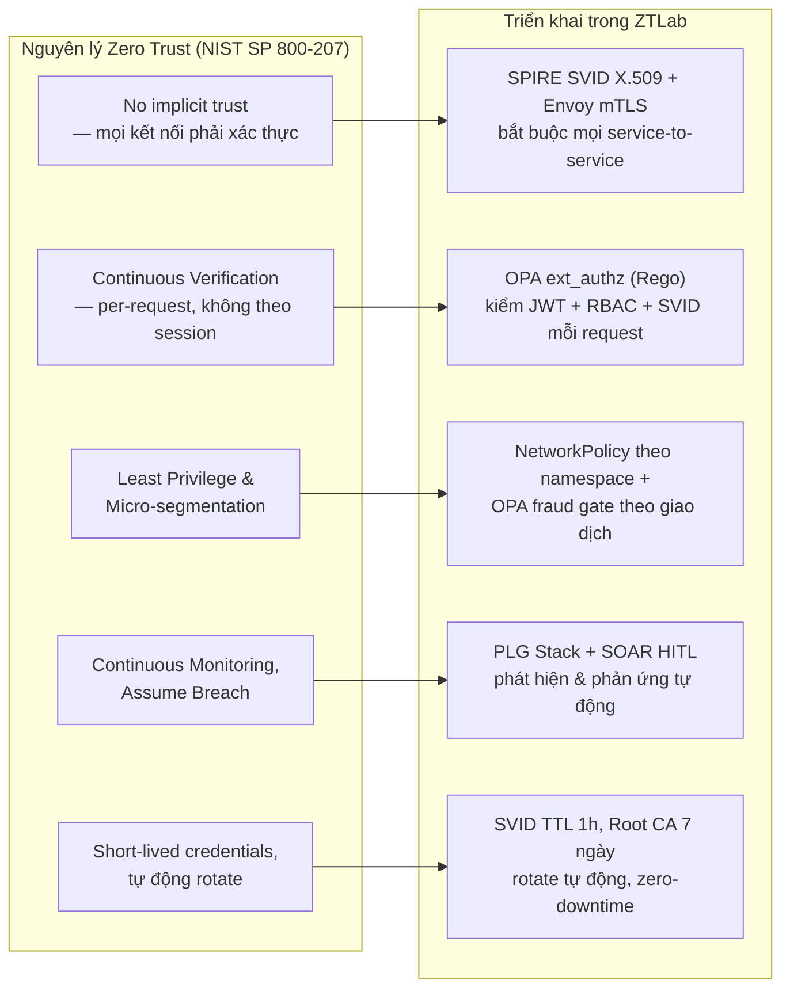
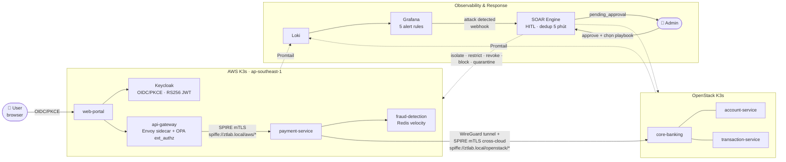

# ZTLab — Zero Trust Security Detection & Response

ZTLab là một **testbed thực nghiệm** hiện thực hoá các nguyên lý Zero Trust Architecture (NIST SP 800-207) trên một hệ thống microservices tài chính triển khai thật trên hai cloud (AWS + OpenStack), thay vì mô phỏng trên giấy hay chạy trên một cụm đơn lẻ. Luồng vận hành: user đăng nhập qua Keycloak OIDC/PKCE, mọi request qua API Gateway đều bị chặn bởi Envoy sidecar + OPA ext_authz trước khi tới ứng dụng, giao dịch được fraud-detection chấm điểm rủi ro (kèm tín hiệu device trust), rồi ghi nhận tại Core Banking trên OpenStack qua kết nối mTLS do SPIRE cấp phát. Log từ cả hai cloud đổ về PLG Stack (Promtail → Loki → Grafana); khi Grafana phát hiện 1 trong 5 mẫu hành vi tấn công đã định nghĩa, SOAR Engine tạo case theo mô hình Human-in-the-Loop (HITL) — admin nhận email kèm nút hành động, chọn playbook, SOAR thực thi trên Kubernetes.

**Cần nói rõ ngay từ đầu:** đây không phải một sản phẩm bảo mật có thể cắm vào hệ thống khác để "tăng bảo mật, giảm tấn công" — toàn bộ policy OPA, alert rule Grafana, playbook SOAR đều viết cứng cho đúng tập endpoint/service của riêng hệ thống này, không tái sử dụng được nguyên trạng cho một hệ thống khác. Phần "Nguyên lý & phạm vi đóng góp" ngay bên dưới nói rõ giá trị thực sự của dự án nằm ở đâu.

---

## Nguyên lý Zero Trust & phạm vi đóng góp

### Vì sao Zero Trust — cho vấn đề gì, không phải "bảo mật" chung chung

Zero Trust là một tập nguyên lý rất rộng (identity, network, device, data, application, analytics...) — nói "áp Zero Trust để bảo mật hơn" là một câu gần như vô nghĩa, vì bất kỳ kiểm soát bảo mật nào (WAF, IDS, mã hoá, patch quản lý...) cũng "bảo mật hơn". Câu hỏi cần trả lời cụ thể hơn: **Zero Trust giải quyết đúng loại lỗ hổng nào mà các mô hình khác về cấu trúc không giải quyết được?**

Mô hình *perimeter-based* (kể cả bản nâng cấp bằng VPC/security group/VPN) đặt giả định: một khi request đã ở "bên trong" ranh giới mạng đã được xác thực (đã qua firewall, đã trong cùng VPC, đã qua VPN), các thực thể bên trong tin tưởng lẫn nhau theo mặc định — trust được cấp theo **vị trí mạng**, không theo **danh tính đã xác minh của từng request**. Với microservices, đây chính là lỗ hổng cấu trúc: nếu một service bị chiếm quyền (dependency độc hại, RCE, credential leak...), kẻ tấn công đã "ở trong ranh giới" và có thể gọi tự do sang service khác — *lateral movement* — mà không kiểm soát nào ở tầng perimeter phát hiện được, vì về bản chất traffic đó chưa từng "vượt biên giới" để bị soi.

Zero Trust (cụ thể là NIST SP 800-207) nhắm thẳng vào đúng lỗ hổng này bằng cách bỏ hẳn khái niệm "network location = mức trust", thay bằng **identity verification + policy evaluation cho từng request, kể cả traffic nội bộ (east-west)** — kiến trúc chuẩn cho việc này là một **Policy Decision Point (PDP)** tách biệt (ở đây là OPA) đưa ra quyết định allow/deny, và **Policy Enforcement Point (PEP)** (Envoy sidecar) là nơi thực thi quyết định đó tại chỗ, ngay cạnh workload. ZTLab không cố hiện thực hoá toàn bộ 7 tenet của SP 800-207 dàn trải — phạm vi thu hẹp có chủ đích vào các tenet có thể đo lường được bằng thực nghiệm: tenet 2 (secure communication regardless of location), tenet 3 + 6 (per-session/per-request authorization, enforced before access), và một phần tenet 4 (dynamic policy) — xem bảng ánh xạ đầy đủ bên dưới.

### Vì sao những lựa chọn thiết kế còn lại

Mỗi lựa chọn dưới đây là một điều kiện cần để câu hỏi nghiên cứu ở trên "có ý nghĩa để kiểm chứng", không phải lựa chọn tuỳ ý:

- **Vì sao microservices, không phải monolith?** Lateral movement — vấn đề cốt lõi Zero Trust nhắm tới — không tồn tại trong một monolith (không có ranh giới mạng nội bộ để "di chuyển" qua). Microservices là điều kiện cần để có một bề mặt service-to-service thật sự cần kiểm chứng: nếu không có nhiều service độc lập gọi nhau qua mạng, câu hỏi "policy per-request có chặn được lateral movement không" không thể đặt ra.
- **Vì sao domain tài chính (banking), không phải một API demo bất kỳ?** Ba lý do cộng dồn: (1) nghiệp vụ tài chính có cấu trúc RBAC tự nhiên (đọc/ghi, teller/admin) — khớp trực tiếp với mô hình phân quyền OPA cần kiểm thử; (2) giao dịch tài chính có một trục rủi ro *theo ngữ cảnh* (số tiền, kênh, tần suất) cho phép mở rộng Zero Trust vượt khỏi "ai được gọi service nào" (tầng identity/network) sang "hành động cụ thể này có nên được phép không" (tầng business logic — chính là fraud gate trong `fraud-detection`) — một cách hiện thực hoá tenet "dynamic policy" đầy đủ hơn phần lớn demo Zero Trust chỉ dừng ở tầng network; (3) ngành tài chính là nơi audit trail (tenet 7 — thu thập tối đa thông tin trạng thái để cải thiện an toàn) có giá trị compliance thật, không phải tính năng phụ.
- **Vì sao hybrid multi-cloud (AWS + OpenStack), không phải một cloud/VPC?** Trong một cloud/VPC duy nhất, security group và IAM sẵn có của nhà cung cấp đã tạo ra một phần ranh giới tin cậy — rất khó tách bạch "cái gì do lớp Zero Trust tự xây tạo ra, cái gì do IAM/SG của cloud provider cho sẵn". Hai cloud có mô hình mạng và IAM khác hẳn nhau (AWS VPC quản lý vs OpenStack tự vận hành) buộc lớp Zero Trust (SPIFFE trust domain dùng chung 1 root CA, WireGuard nối tầng mạng, OPA policy nhất quán) phải tự chịu trách nhiệm toàn bộ việc thiết lập trust xuyên biên giới — cô lập đúng phần đóng góp của kiến trúc đang được kiểm chứng, không lẫn với hạ tầng có sẵn.
- **Vì sao tự dựng VM + Terraform/Ansible/K3s, không dùng PaaS/SaaS quản lý sẵn (EKS+App Mesh, managed Istio, Auth0/Cognito...)?** Vì câu hỏi nghiên cứu chính là *chi phí vận hành thật của việc thêm lớp Zero Trust là bao nhiêu* (xem SYSTEM_EVALUATION.md) — nếu dùng dịch vụ quản lý sẵn, chính phần cần đo (latency OPA eval, chi phí cấp/xoay SVID, độ phức tạp giữ pipeline tái tạo được) sẽ nằm trong control plane đóng của nhà cung cấp, không đo được, không giải thích được. Tự dựng từng lớp (SPIRE server/agent, Envoy sidecar, OPA) khiến mọi thứ minh bạch và đo được. Việc này cũng phản ánh gần hơn với thực tế triển khai của nhiều tổ chức tài chính có ràng buộc chủ quyền dữ liệu/pháp lý buộc phải giữ một phần hạ tầng tự vận hành (private cloud kiểu OpenStack) thay vì toàn bộ trên PaaS công cộng.
- **Vì sao NIST SP 800-207, không phải Forrester ZTX hay BeyondCorp?** SP 800-207 là chuẩn liên bang Mỹ, trung lập vendor, được CISA và DoD Zero Trust Reference Architecture dẫn chiếu làm nền — khác với các khung thương mại (Forrester ZTX là sản phẩm tư vấn) hay case study riêng của một hãng (BeyondCorp mô tả triển khai nội bộ của Google, không phải chuẩn tổng quát). Quan trọng hơn: SP 800-207 định nghĩa Zero Trust bằng **tenet** (thuộc tính hệ thống phải có) chứ không quy định sản phẩm cụ thể — cho phép kiểm chứng theo kiểu "hệ thống có đạt tenet X hay không" một cách khách quan, thay vì đối chiếu với tiêu chí mơ hồ.

### Khác gì so với các tính năng Zero Trust có sẵn trên cloud

Cả AWS, GCP, Azure đều bán sản phẩm gắn mác "Zero Trust" — cần nói rõ vì sao dựng riêng thay vì dùng thẳng, nếu không phần lý luận ở trên sẽ bị hiểu nhầm là làm lại thứ đã có sẵn. Điểm khác biệt nằm ở **ranh giới bài toán mà từng loại sản phẩm giải quyết**, không phải mức độ "Zero Trust" nhiều hay ít:

- **ZTNA (Zero Trust Network Access) — AWS Verified Access, GCP BeyondCorp Enterprise, Azure AD Conditional Access:** nhóm sản phẩm này giải quyết bài toán *user-to-app* — thay thế VPN cho người dùng/nhân viên truy cập ứng dụng nội bộ, dựa trên identity provider + device posture. Đây **không phải** bài toán ZTLab nhắm tới. ZTLab tập trung vào *workload-to-workload* (service gọi service, east-west traffic sau khi request đã vào trong cluster) — một lớp hoàn toàn khác, thường do sản phẩm khác của chính cloud đó đảm nhiệm (xem mục tiếp theo), và thường ít được gắn mác "Zero Trust" trong marketing dù về bản chất mới là nơi lateral movement thật sự xảy ra.
- **Service mesh managed — AWS App Mesh, GCP Anthos Service Mesh (đều dựa trên Envoy/Istio):** đây mới là nhóm gần nhất với những gì ZTLab làm (sidecar proxy, mTLS, policy). Khác biệt chính: các dịch vụ managed này **chạy trong một cloud, gắn với control plane của chính cloud đó** — không có sản phẩm managed nào của AWS mở rộng identity/policy sang một workload đang chạy trên OpenStack. SPIFFE/SPIRE giải quyết đúng khoảng trống này: `trust domain` của SPIFFE là một khái niệm **độc lập với cloud provider**, một workload ở AWS và một workload ở OpenStack xác minh lẫn nhau bằng chứng chỉ ký bởi cùng 1 root CA, không cần gọi lại API của bất kỳ cloud nào để verify.
- **IAM-based service-to-service auth — AWS IAM roles, resource policies, VPC Lattice:** cách phổ biến để một service AWS gọi service AWS khác "an toàn" là dùng IAM role assumption — nhưng đây là một dạng trust đặt vào **control plane của cloud provider** (STS, IAM), không phải một danh tính cryptographic độc lập, tự-chứng-minh (self-contained) như SPIFFE SVID (X.509 cert, verify được ngay tại chỗ, không cần round-trip gọi ngược lại IAM). Khác biệt này chỉ thật sự quan trọng khi hai bên giao tiếp **không thuộc cùng một control plane** — đúng tình huống hybrid-cloud của ZTLab, không quan trọng nếu chỉ chạy trong 1 AWS account.
- **Policy-as-code tập trung (OPA/Rego) so với IAM policy JSON rải rác theo từng resource:** IAM policy attach vào từng role/resource riêng lẻ — muốn biết "ai được làm gì" phải tổng hợp từ nhiều nơi. OPA tách hẳn quyết định phân quyền ra một service riêng (Policy Decision Point), một file Rego là nguồn sự thật duy nhất, version-control được, test được độc lập với hạ tầng — gần với triết lý "Policy as Code" hơn là "Infrastructure Configuration".

**Những gì cloud-native ZT làm tốt mà ZTLab không cố làm lại:** device posture/health attestation tích hợp EDR (CrowdStrike, Jamf...), identity federation quy mô doanh nghiệp (SSO hàng chục nghìn user), DDoS/edge protection, và — quan trọng nhất — **vận hành dưới dạng managed service** (không phải tự vá lỗi deploy như đã ghi trong SYSTEM_EVALUATION.md). ZTLab đánh đổi sự tiện lợi đó để lấy khả năng đo lường và tính di động xuyên hạ tầng — một đánh đổi có chủ đích, không phải vì không biết tới các sản phẩm cloud-native.

### Zero Trust áp dụng ở lớp nào, và ZTLab có phải "khung giải pháp mới" không

**Không.** ZTLab không đề xuất một mô hình Zero Trust mới — nó là một **hiện thực hoá cụ thể** của SP 800-207 bằng các thành phần mã nguồn mở sẵn có (SPIFFE/SPIRE, OPA, Envoy, Grafana, một SOAR tự viết), áp dụng có chọn lọc, không đều, lên 7 tenet gốc:

| # | Tenet (NIST SP 800-207) | ZTLab có làm không | Bằng gì |
|---|---|---|---|
| 1 | *All data sources and computing services are considered resources* | Một phần | OPA phân biệt `internal_service_request` (có SVID) vs `external_api_request` (không SVID) theo **danh tính đã xác minh** (identity), không theo IP/network location — đúng tinh thần tenet, nhưng vẫn là một dạng phân loại request, không xử lý "mọi resource hoàn toàn như nhau" |
| 2 | *All communication is secured regardless of network location* | Có | mTLS bắt buộc mọi service-to-service qua Envoy + SPIRE SVID, kể cả cross-cloud qua WireGuard tunnel |
| 3 | *Access to resources is granted on a per-session basis* | Có | SVID TTL 1 giờ, auto-rotate; mỗi request đi qua OPA ext_authz riêng biệt — không có khái niệm "authenticated once, trusted thereafter" |
| 4 | *Access determined by dynamic policy* (identity, app, asset, behavioral attributes) | Một phần | OPA dùng role (RBAC) + trạng thái SVID; fraud-detection mở rộng thêm behavioral attribute (amount/channel/velocity) cho riêng luồng giao dịch — nhưng chưa có device posture/health attestation |
| 5 | *Monitor and measure the integrity/security posture of all assets* | Một phần | `security-scanner-job.yaml` kiểm tra container posture (uid, Linux capabilities), giờ đã nối vào pipeline detection→response thật (`privilege-escalation-alert.yml` → SOAR case `privilege_escalation`, playbook `quarantine_workload`, xác nhận 2026-08-20) — nhưng vẫn chỉ *phát hiện sau khi đã chạy*, chưa *ngăn tạo* container vi phạm ngay từ đầu (cần K8s admission control, chưa có) |
| 6 | *Authentication/authorization are dynamic and strictly enforced before access* | Có | `failure_mode_allow: false` ở Envoy ext_authz — OPA lỗi/timeout thì deny, không fail-open |
| 7 | *Collect information on assets/network state to improve security posture* | Có | PLG Stack + audit log OPA (`decision_id` riêng từng decision) + SOAR case log — dùng để detect, respond, và điều chỉnh policy (ví dụ: incident lệch JWT issuer ngày 2026-08-13, fix bằng chuyển sang OIDC discovery thay vì hardcode) |

Diễn giải bảng trên bằng một câu: ZTLab làm tốt các tenet thuộc phạm trù *identity + network + policy enforcement* (2, 3, 6, một phần 4), còn tenet thuộc phạm trù *device/asset posture* (5) mới dừng ở mức thủ công/one-off — đây không phải sơ suất che giấu mà là ranh giới phạm vi có chủ đích của một đồ án quy mô lab, đã nói rõ ở phần "ZTLab đóng góp gì" bên dưới.

Gộp các tenet có liên quan lại thành 5 nhóm nguyên lý thực hành (không phải một danh sách cạnh tranh với bảng 7 tenet ở trên — chỉ là cách trình bày cô đọng hơn cho sơ đồ), ánh xạ sang từng thành phần cụ thể đang chạy:



### ZTLab đóng góp gì — và không đóng góp gì

Cần tách bạch hai loại tuyên bố dễ bị nhầm lẫn với nhau:

1. *"Hệ thống này chặn được N request tấn công trong bài test"* — đây là **kết quả thực nghiệm có thật**, đo được (xem [SYSTEM_EVALUATION.md](SYSTEM_EVALUATION.md)).
2. *"Hệ thống này làm giảm tấn công / tăng bảo mật"* — đây là một tuyên bố **không có nghĩa** ở phạm vi một lab/testbed đơn lẻ. ZTLab không bảo vệ bất kỳ tài sản thật nào ngoài chính nó; nó không phải một control có thể "lắp vào" một hệ thống khác để hệ thống đó an toàn hơn. Toàn bộ Rego policy (`opa/policies/`), alert rule Grafana (`plg-stack/grafana/alerting/`), và playbook SOAR (`services/soar-engine/main.py`) đều viết cứng theo đúng tên endpoint/service/namespace của riêng hệ thống này — di chuyển nguyên trạng sang một codebase khác sẽ không hoạt động, phải viết lại từ đầu theo bề mặt tấn công (attack surface) của hệ thống đích.

Vậy giá trị thực của dự án nằm ở đâu, nếu không phải "giảm tấn công"? Ba điểm, xếp theo mức độ chắc chắn giảm dần:

**1. Bằng chứng thực nghiệm về operational feasibility — và về cái giá thật của nó.** Cần nói chính xác: đóng góp **không phải** "ZTLab là một hệ thống chạy được" — bản thân một artifact chạy được không phải kết quả nghiên cứu, và trên thực tế pipeline này **không** tự chạy trơn tru qua các lần destroy/redeploy (xem Mục 0, SYSTEM_EVALUATION.md: 4 lỗi cụ thể — race condition với cloud-init, SSH host-key sau khi VM đổi, resource K8s bị thiếu khiến SOAR treo, sai `client_id` Keycloak ở 4 script test — chỉ lộ ra khi dựng lại từ số 0, không lộ ra khi chỉnh sửa nhỏ trên cluster đang chạy). Đóng góp thật nằm ở **quá trình lặp lại thực nghiệm đó**: lắp SPIFFE/SPIRE (workload identity) + OPA (policy-as-code, đóng vai Policy Decision Point) + Envoy sidecar (Policy Enforcement Point) + PLG stack/SOAR (vòng lặp detect–respond) thành một pipeline xuyên hai cloud có mô hình mạng/IAM hoàn toàn khác nhau, rồi *đo lại chính xác nó gãy ở đâu và vì sao* mỗi lần dựng lại từ số 0 — đây là dữ liệu về chi phí kỹ sư thật của Zero Trust mà phần lớn tài liệu SP 800-207 (vốn dừng ở mức nguyên lý trừu tượng) không đề cập tới.

**2. Số liệu chi phí runtime thật, thay vì ước lượng lý thuyết.** Câu hỏi "áp Zero Trust thì tốn thêm bao nhiêu mỗi request?" thường chỉ được trả lời định tính trong tài liệu tham khảo. SYSTEM_EVALUATION.md đưa ra con số đo được cụ thể cho *chính kiến trúc này* (không suy rộng ra kiến trúc khác được): overhead latency ở lớp JWT+OPA (per-request), overhead CPU/RAM của SPIRE/OPA/SOAR so với phần còn lại của cluster (steady-state, khác với chi phí *dựng lại* pipeline đã nói ở điểm 1). Đây là loại dữ liệu hữu ích cho người *đang cân nhắc* áp dụng một kiến trúc tương tự, để so sánh đánh đổi — không phải bằng chứng "hệ thống nào có Zero Trust thì an toàn hơn hệ thống không có".

**3. Giới hạn của cách tiếp cận — cũng là một phần đóng góp, không phải điểm trừ cần giấu đi.** Lớp detection của ZTLab hoàn toàn dựa trên rule tĩnh (LogQL ngưỡng cố định) — không học được pattern mới, không phân biệt được tấn công chậm/rải rác với hành vi bình thường, và **không suy rộng ra ngoài 5 kịch bản đã định nghĩa sẵn**: một kỹ thuật tấn công không khớp bất kỳ LogQL nào sẽ đi qua mà không để lại dấu vết cảnh báo. OPA trong hệ thống này cũng không tự verify chữ ký JWT (việc đó giao cho tầng ứng dụng) — một chi tiết thiết kế cụ thể, không phải giới hạn chung của OPA. Ghi nhận rõ những giới hạn theo-thiết-kế này quan trọng hơn là quảng bá con số "chặn 100% trong bài test" — con số đó chỉ đúng vì bài test được thiết kế để khớp đúng rule đã viết, không phải một phép đo hiệu quả phòng thủ tổng quát.

Tóm lại: ZTLab nên được đọc như **một nghiên cứu thực nghiệm về tính khả thi và chi phí vận hành** của Zero Trust Architecture trong bối cảnh microservices đa cloud, kèm bộ số liệu đo được làm minh chứng — chứ không phải một sản phẩm, một bộ policy tái sử dụng được, hay một tuyên bố về hiệu quả phòng thủ trong thực tế sản xuất.

---

## Kiến trúc



**Stack:**
- **Identity:** Keycloak OIDC/PKCE, SPIFFE/SPIRE X.509 SVIDs (trust domain `ztlab.local`, gia hạn ~30 phút)
- **Policy:** Envoy sidecar + OPA ext_authz gRPC — JWT verify, RBAC, fraud gate, SVID check
- **Services:** FastAPI microservices trên K3s (AWS + OpenStack), Redis, PostgreSQL
- **Observability:** Promtail → Loki → Grafana (5 alert rules thật, gửi webhook mỗi 1 phút khi fire)
- **Security Ops:** SOAR Engine — HITL, 5 playbooks, email HITL với action buttons, dedup 5 phút/attack_type

---

## Cấu trúc repo

```
terraform/          Provisioning AWS + OpenStack (IaC)
ansible/            Inventory + playbooks cấu hình nodes
k8s/                Kubernetes manifests (financial, identity, plg-stack, monitoring)
opa/policies/       Rego: zta_policy (JWT, RBAC, fraud gate, SVID)
spire/              SPIRE server/agent configs + K8s manifests
envoy/              Envoy sidecar configmap (mTLS, OPA ext_authz)
services/           FastAPI microservices source code
shared/             Python shared modules (logging, metrics)
monitoring/         Prometheus scrape config
scripts/            deploy-all, deploy-app, destroy-all, k8s-tunnel, open-admin-uis, run-demo, patch-services, sync-images
tests/              seed_db, scenario tests
ml-dataset/         Script + tài liệu sinh dataset train/test cho nhóm ML/DL (xem ml-dataset/README.md)
```

---

## Yêu cầu trước khi deploy

Hướng dẫn cài đặt từng bước thủ công (dùng khi debug hoặc muốn hiểu rõ từng khâu) nằm ở **[DEPLOY.md](DEPLOY.md)**. Phần dưới đây chỉ tóm tắt những gì cần chuẩn bị trước.

**Công cụ** (script `deploy-all.sh` tự cài phần lớn, xem Bước 1 [DEPLOY.md](DEPLOY.md)): Ansible, Docker, kubectl, Terraform, AWS CLI, OpenStack CLI, jq, openssl, socat.

**Tài khoản cloud:** AWS IAM access key (đủ quyền tạo VPC/EC2/security group), tài khoản OpenStack (project + user đã có quota).

**Biến bắt buộc trong `.env`** (copy từ `.env.template`):

| Biến | Ý nghĩa |
|---|---|
| `AWS_ACCESS_KEY_ID` / `AWS_SECRET_ACCESS_KEY` | IAM key để Terraform provision AWS |
| `AWS_DEFAULT_REGION` | Mặc định `ap-southeast-1` |
| `OS_AUTH_URL` / `OS_USERNAME` / `OS_PASSWORD` / `OS_PROJECT_NAME` / `OS_REGION_NAME` | Credential OpenStack (Keystone v3) |
| `KEYCLOAK_ADMIN_PASSWORD` | Mật khẩu admin Keycloak — script tạo secret từ giá trị này lúc deploy |
| `KEYCLOAK_DB_PASSWORD` | Mật khẩu Postgres nội bộ cho Keycloak |

**Biến tuỳ chọn** (có default, chỉ cần đổi nếu muốn hành vi khác):

| Biến | Default | Khi nào cần đổi |
|---|---|---|
| `AI_PROVIDER` | `heuristic` | Đổi `openai`/`gemini` để AI Analyzer gọi LLM thật — phải kèm `OPENAI_API_KEY`/`GEMINI_API_KEY` |
| `SOAR_DRY_RUN` / `SOAR_AUTO_EXECUTE` | `true` | Tắt dry-run nếu muốn SOAR thực thi hành động thật trên cluster |

> Một vài biến trong `.env.template` (`AWS_GATEWAY_PRIVATE_KEY`, `OS_GATEWAY_PRIVATE_KEY`, `SPIRE_JOIN_TOKEN`, `GRAFANA_ADMIN_PASSWORD`, `TERRAFORM_STATE_BUCKET`, `TERRAFORM_LOCK_TABLE`) hiện **không script nào đọc** — WireGuard/SPIRE tự sinh key lúc deploy, mật khẩu Grafana đang hardcode trong `k8s/plg-stack/grafana.yaml`. Khỏi cần điền các biến này.

---

## Bắt đầu nhanh

```bash
bash scripts/deploy-all.sh             # dựng hạ tầng + deploy toàn bộ từ số 0
bash scripts/destroy-all.sh            # gỡ hạ tầng khi cần dừng/dựng lại sạch

bash scripts/k8s-tunnel.sh up all      # mở tunnel tới 2 cluster
bash scripts/open-admin-uis.sh         # mở toàn bộ port-forward (tự-restart)
bash scripts/run-demo.sh --restore     # đưa hệ thống về trạng thái sạch
bash scripts/run-demo.sh               # normal traffic + 4 kịch bản tấn công
```

---

## URLs khi đang chạy

| Service | URL | Credential |
|---------|-----|------------|
| Web Portal | http://localhost:18081 | testuser01 / 
Test1234! (Keycloak SSO) |
| API Gateway | http://localhost:18080 | JWT Bearer |
| Keycloak Admin | http://localhost:8180 | admin / ztlab-admin-2026 |
| Grafana | http://localhost:3000 | admin / ZTALab2026! |
| SOAR Engine | http://localhost:8091 | — |
| AI Analyzer | http://localhost:18082 | — |
| Prometheus | http://localhost:9090 | — |
| Loki | http://localhost:13100 | — |
| pgAdmin | http://localhost:5050 | admin@ztlab.com / ztlab2026 |

---

## Tài khoản demo

| User | Password | Role | Tài khoản |
|------|----------|------|-----------|
| `testuser01` | `Test1234!` | financial-read, financial-write | ACC-1001 |
| `testuser02` | `Test1234!` | financial-read, financial-write | ACC-2001 |
| `merchant01` | `Test1234!` | financial-read (chỉ đọc — demo RBAC 403) | ACC-4001 |
| `demoadmin` | `Test1234!` | security-admin + security-analyst (full quyền: `/admin`, `/security`, `/scenarios`, `/monitor`, phê duyệt HITL) | — |
| `soc01` | `Test1234!` | security-analyst — dùng để chạy `/scenarios` trên Web Portal (role-gated) | — |
| `analyst01` | `Test1234!` | security-analyst — **login qua Keycloak hiện bị lỗi** (redirect loop ở login-actions/authenticate, chưa rõ nguyên nhân); dùng `demoadmin` hoặc `soc01` thay thế | — |

---

## 6 kịch bản tấn công Zero Trust (Grafana → SOAR)

Có **hai bộ script khác cơ chế** cho cùng các kịch bản — cần phân biệt rõ, không đánh đồng:

- **`tests/grafana_kb{1,2,3,5}_*.sh`** — tạo **traffic thật**, đi qua đúng enforcement point thật (Envoy/OPA/api-gateway), lấy `response_code` thật từ hệ thống. Đây là bằng chứng enforcement hoạt động.
- **`scripts/run-demo.sh --kb{1,2,3,4}`** — **đẩy thẳng dòng log giả lập vào Loki** (không gọi request thật, không đi qua enforcement point nào) để trình diễn nhanh phần detection→SOAR (Grafana fire → case → email HITL) mà không cần chờ traffic thật tích luỹ. Hữu ích để demo luồng phản ứng, **không phải bằng chứng enforcement** — enforcement đã được xác nhận riêng bằng bộ script `tests/grafana_kb*.sh` ở trên.
- **`k8s/financial/security-scanner-job.yaml`** — Job kiểm tra posture container, chạy độc lập qua `kubectl apply`, ghi log AUDIT thật.

| Tên | ATT&CK | Enforcement thật (đã xác nhận qua traffic/log thật) | Phát hiện Grafana | SOAR Playbook |
|-----|--------|------------------|-------------------|----------------|
| Brute Force Login | T1110.001 | Token không đúng cấu trúc JWT → OPA `valid_jwt` fail → Envoy 403 (**không** phải Keycloak login, không phải lỗi 401 ở tầng app — xem [FLOW_DETAIL.md](FLOW_DETAIL.md) §4) | `brute-force-alert.yml` | revoke_user_sessions |
| Lateral Movement | T1021.007 | Service có **SVID hợp lệ thật** (`notification-service`) gọi path nội bộ không nằm trong whitelist OPA của `payment-service` → 403 (**không** phải SVID giả — xem §6) | `lateral-movement-alert.yml` | isolate_workload |
| Fraud Gate Bypass | T1078.004 | fraud-detection chấm điểm giao dịch 500M/kênh tor = 75 điểm ≥ ngưỡng → payment-service tự chặn, không gọi core-banking (403) | `fraud-gate-bypass-alert.yml` | isolate_workload |
| Data Exfiltration | T1041 | (chỉ kiểm thử qua `run-demo.sh --kb4` — log giả lập `bytes_sent` > 1 MiB, chưa có phiên bản traffic thật) | `large-response-alert.yml` | restrict_egress |
| Access Denied Spike | T1078 | `merchant01` (role financial-read) POST /payments → OPA RBAC deny 6/6 (403) | `access-denied-alert.yml` | block_source_ip |
| Privilege Escalation in Container | T1068 | `security-scanner-job.yaml` phát hiện container chạy uid=0 + dangerous capabilities (CAP_DAC_OVERRIDE, CAP_SETUID...) — log AUDIT thật | `privilege-escalation-alert.yml` | quarantine_workload |

> **Cập nhật 2026-08-20:** trước đây `access-denied-alert.yml` và Privilege Escalation đều chưa thật sự wire (2 bug đã tìm và vá: `access-denied-alert.yml` bị thiếu trong `provision_grafana_configmaps()` của `scripts/deploy-app.sh` dù file tồn tại — chưa từng nạp vào Grafana thật dù tài liệu trước đó ghi nhận nhầm là đã hoạt động; Privilege Escalation có sẵn 1 bản rule soạn dở trong file cũ không được apply, và SOAR thiếu hẳn key `privilege_escalation` trong 5 dict taxonomy — cả 2 giờ đã vá tận gốc và xác nhận tạo SOAR case thật). Lưu ý MITRE đúng là **T1068** (Exploitation for Privilege Escalation) cho kịch bản này, khác **T1611** (Escape to Host — `container_escape`, một kỹ thuật khác, `ai-analyzer.yaml` có pattern riêng, chưa có kịch bản demo).

> **HITL Flow:** severity ≥ high → SOAR tạo case `pending_approval` → email voha2005@gmail.com → admin duyệt tại Web Portal /security → playbook thực thi trên K8s.

> **Dedup:** SOAR giới hạn 1 case/attack_type/5 phút.

```bash
# Enforcement thật (khuyến nghị để kiểm chứng hệ thống):
bash tests/grafana_kb1_brute_force.sh
bash tests/grafana_kb2_fraud_gate.sh
bash tests/grafana_kb3_lateral_movement.sh
bash tests/grafana_kb5_access_denied.sh
bash tests/grafana_run_all.sh              # chạy cả 4 script trên liên tiếp

# Demo nhanh luồng detection → SOAR (log giả lập, xem lưu ý ở trên):
bash scripts/run-demo.sh --kb1   # --kb2 --kb3 --kb4 tương tự

# Restore sau demo (xóa cả soar-block NetworkPolicies):
bash scripts/run-demo.sh --restore
```

Chi tiết vận hành/redeploy: xem **[DEPLOY.md](DEPLOY.md)**.

## Demo log hệ thống

| Log | Lệnh xem | Ý nghĩa |
|-----|----------|---------|
| Envoy access | `kubectl logs -n financial deploy/api-gateway -c envoy` | source_ip, response_code, bytes_sent, svid |
| OPA decision | `kubectl logs -n financial deploy/opa-server` | result=true/false, path, input attributes |
| SPIRE agent | `kubectl logs -n spire daemonset/spire-agent` | SVID renewal mỗi ~30 phút |
| SOAR cases | `curl http://localhost:8091/cases` | attack_type, severity, source_ip, status |
| Grafana Loki | http://localhost:3000 → Explore | Query: `{job="envoy-access"} \| json \| response_code=401` |
